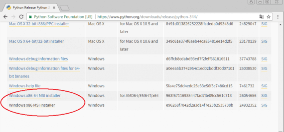
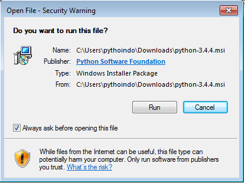
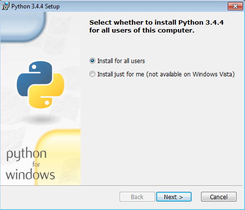
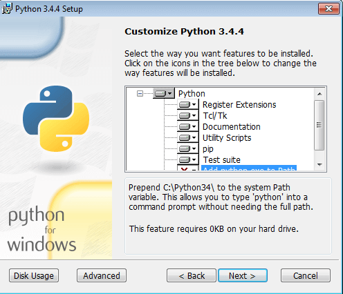
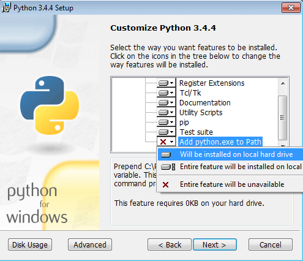
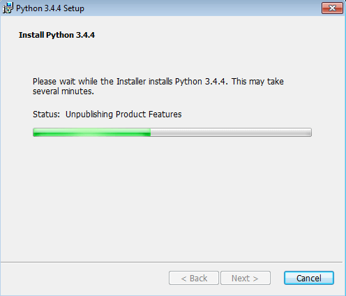
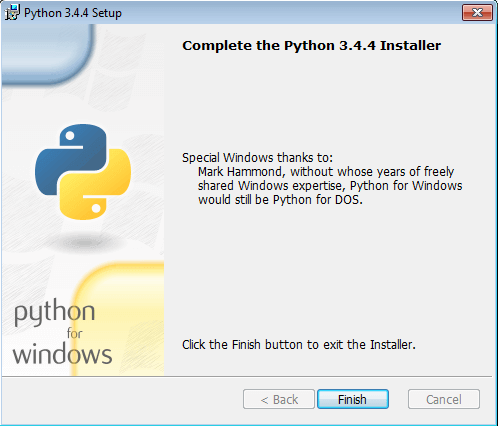
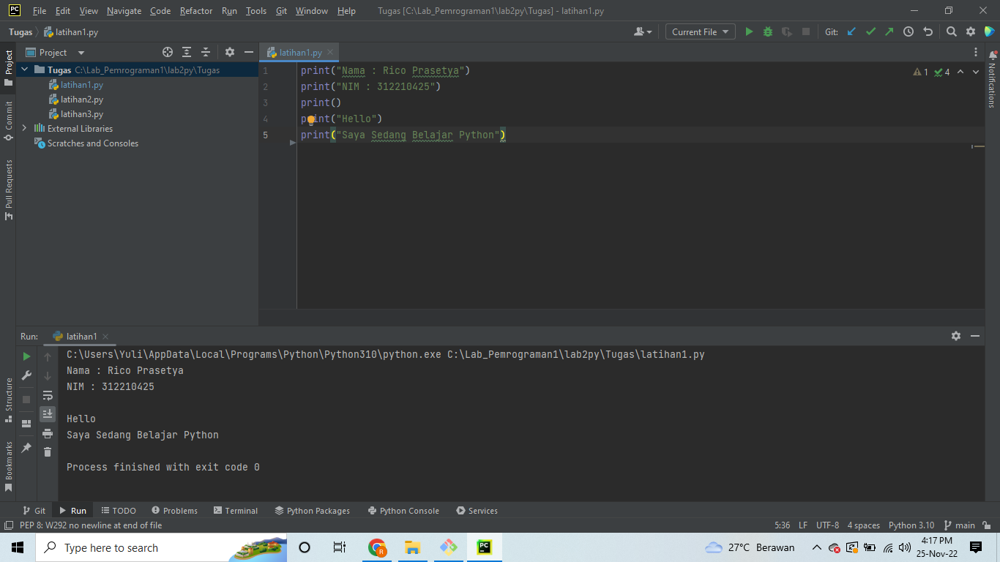
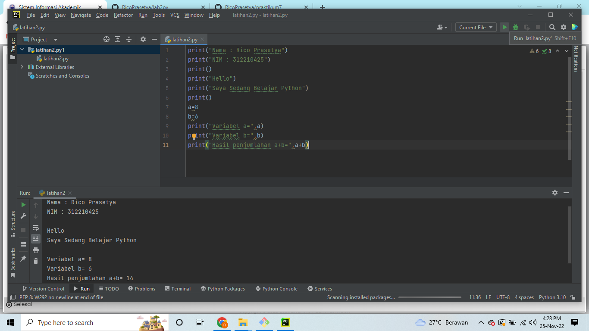

# Latihan Phyton
## Tutorial Penggunaan Phyton
### Download Phyton

Download installer python di situs https://www.python.org/download. Di sini kita menggunakan python versi 3.4. Bila Anda bingung yang mana linknya, silahkan klik saja link ini:https://www.python.org/downloads/release/python-344/. Silahkan pilih apakah Anda mau menggunakan versi 32 bit, atau 64 bit. Di sini kita gunakan versi 32 bit.

Tunggu hingga proses download selesai. Setelah selesai, buka folder tempat python terdownload. Biasanya bila menggunakan windows, program terdownload akan masuk ke folder Download. Bila sudah ketemu, klik 2 kali. Akan muncul halaman peringatan (bila Anda menggunakan windows 7). Klik saja Run.

Selanjutnya, akan muncul kotak dialog berikutnya. Pilih Install For All Users. Kemudian klik Next.

Pastikan program terinstall di C:\Python34. Klik Next.

Di kotak dialog kostumisasi Python, scroll ke bawah, dan pilih Add Python.exe to path. Pilih Will be installed on local hardrive. Klik Next.

Tunggu sampai proses instalasi selesai.

Bila sudah selesai, akan keluar kotak dialog sebagai berikut. Hal ini menandakan bahwa python sudah terinstal di komputer Anda dan sudah siap untuk digunakan. Klik Finish.

Demikianlah proses instalasi Python di Windows. Python sudah siap digunakan untuk membuat program yang Anda inginkan.

### Menampilkan kalimat

• Menampilkan tulisan “Hello” dilayar
• Menampilkan tulisan “Saya sedang belajar python” dilayar

### Menjumlahkan dua buah bilangan menggunakan variabel a dan b

• Mendefinisikan variable a dengan nilai 8
• Mendefinisikan variable b dengan nilai 6
• Mencetak nilai variable a dan b
• Mencetak hasil penjumlahan a+b

### Menjalankan IDLE

